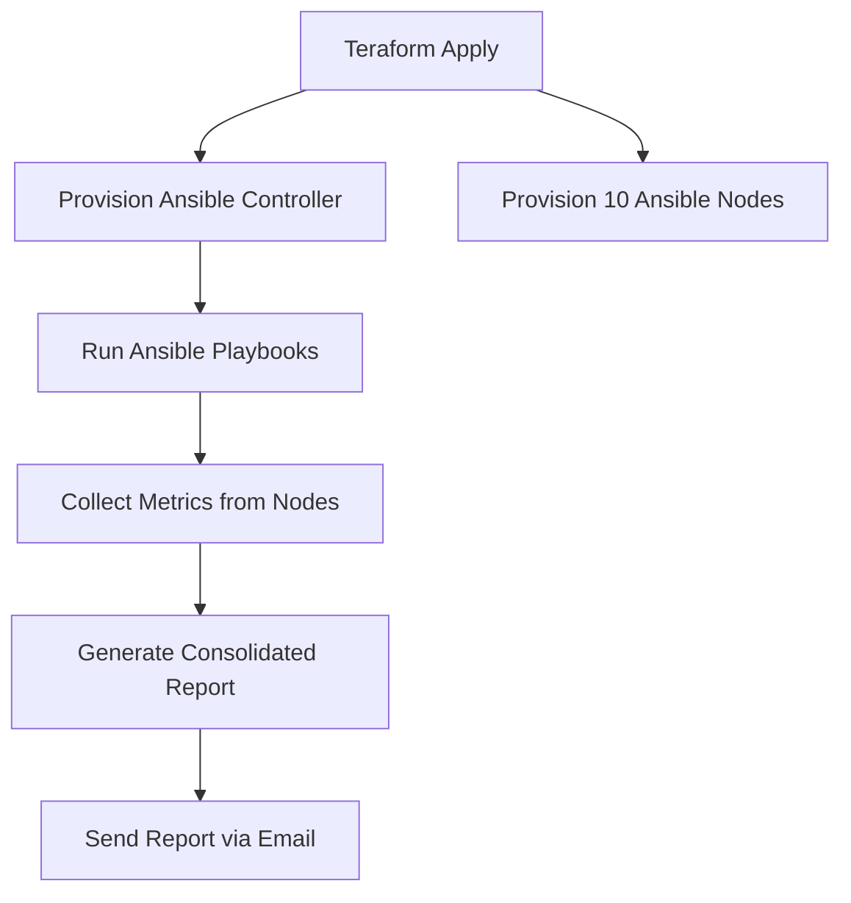

# AWS Infrastructure Automation & Monitoring with Terraform + Ansible


## Ì∫Ä Project Overview
This project demonstrates how to **provision AWS infrastructure using Terraform** and then **monitor the provisioned servers using Ansible**.  
The workflow is fully automated:
- **Terraform** provisions:
  - 1 Ansible Controller
  - 10 Ansible Nodes
- **Ansible**:
  - Collects system metrics (CPU, Memory, Disk usage)
  - Generates a consolidated report
  - Sends the report via email with animated HTML template

---

## ÌøóÔ∏è Architecture



---

## ⚙️ Tech Stack

̺ç Terraform ‚Äì Infrastructure as Code (IaC) \
☁️ AWS EC2 – Virtual machines for controller and nodes \
Ì¥ë IAM Roles ‚Äì Secure permissions for Ansible controller \
Ì¥ñ Ansible ‚Äì Configuration management & monitoring \
Ì∞ç Python + Boto3 ‚Äì AWS dynamic inventory \
Ì≥ß Zoho Mail SMTP ‚Äì Email reporting system 

## ̪†Ô∏è Terraform Setup
```bash
# Initialize Terraform
terraform init

# Preview the infrastructure
terraform plan

# Apply and create infrastructure
terraform apply -auto-approve
```


Terraform will:

Ì∂•Ô∏è Create an Ansible Controller with Ansible pre-installed \
‚ö° Spin up 15 EC2 Nodes with SSH key injected \
Ìø∑Ô∏è Tag instances (Role=master, Role=slave) for dynamic inventory


---

## Ì≥Ç Ansible Files


⚙️ ansible.cfg → basic config \
Ì≥ú inventory.aws_ec2.yml ‚Üí dynamic AWS inventory \
Ì≥ä collect_metrics.yml ‚Üí collects CPU, memory, disk usage \
Ì≥§ send_report.yml ‚Üí generates & emails HTML report \
▶️ playbook.yml → main playbook (imports both above) \
Ìæ® templates/report_email_animated.html.j2 ‚Üí animated HTML email template

---
## ▶️ Running Ansible
```bash
# Test inventory
ansible-inventory -i inventory.aws_ec2.yml --graph

# Run the full playbook
ansible-playbook -i inventory.aws_ec2.yml playbook.yml
```


## Ì≥ä Sample Report

Report is generated in vm_report.html \
Email is sent to configured recipient (group_vars/all.yml)

report on my gmailÌ≥©:


## Ì¥Æ Future Improvements

Replace email with Slack / Teams alerts \
Integrate with Prometheus + Grafana for dashboards \
Add AutoScaling Group for dynamic node provisioning \
Use Terraform remote backend (S3 + DynamoDB) for production state management

---
## Ì∑ë‚ÄçÌ≤ª Author
### Hesham Mohamed Soliman Elngar


